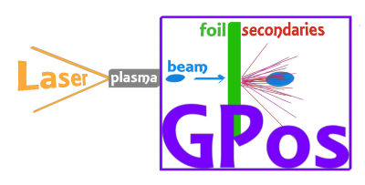

## Overview

**GPos** is a simple-to-use and open source code developed to facilitate the use of the Monte Carlo based Geant4 C++ parallel toolkit to simulate particle sources where a relativistic beam is sent into a solid target as well as the particles propagation in vacuum / trough a thin lens.

## Documentation

[](https://geant4.web.cern.ch/)
[](https://apc.u-paris.fr/~franco/g4doxy4.10/html/md___volumes__work_geant_geant4_810_800_8p01_examples_extended_parallel__m_p_i__r_e_a_d_m_e.html)
[](https://www.openPMD.org)
 
In order to learn how to install and run the code, please see the online documentation:
https://gpos.readthedocs.io

To know more details about the source code, please refer to the `doxygen <https://GPos.readthedocs.io/en/latest/_static/doxyhtml/html/index.html>`_ documentation or use `doxygen` and `graphviz` to build it locally via:
```console
$ cd GPos/docs
$ doxygen Doxygen
``` 
and point your browser to the *doxyhtml/index.html* file generated.

Feel free to open an issue on this repo to report bugs and request changes.


## Release

The latest release is always available with the `releases/latest` tag.


## Author and citation

GPos was built by Ligia Diana Amorim (LDianaAmorim@lbl.gov) dedicated to the simulation of future positron sources employing the unique laser-plasma infrastructure available at the BELLA center of LBNL.

If you are referencing GPos in a publication, please cite the following paper:

 * L. D. Amorim, S. S. Bulanov, C. Benedetti and J.-L. Vay,
   **GPos: a simple tool to model positron sources** (to be submitted 2021).


## License

Geant4 based positron beam source (GPos) Copyright (c) 2021, The
Regents of the University of California, through Lawrence Berkeley
National Laboratory (subject to receipt of any required approvals
from the U.S. Dept. of Energy). All rights reserved.

If you have questions about your rights to use or distribute this software,
please contact Berkeley Lab's Intellectual Property Office at
IPO@lbl.gov.

NOTICE.  This Software was developed under funding from the U.S. Department
of Energy and the U.S. Government consequently retains certain rights.  As
such, the U.S. Government has been granted for itself and others acting on
its behalf a paid-up, nonexclusive, irrevocable, worldwide license in the
Software to reproduce, distribute copies to the public, prepare derivative 
works, and perform publicly and display publicly, and to permit others to do so.

License for GPos can be found at [LICENSE](LICENSE).