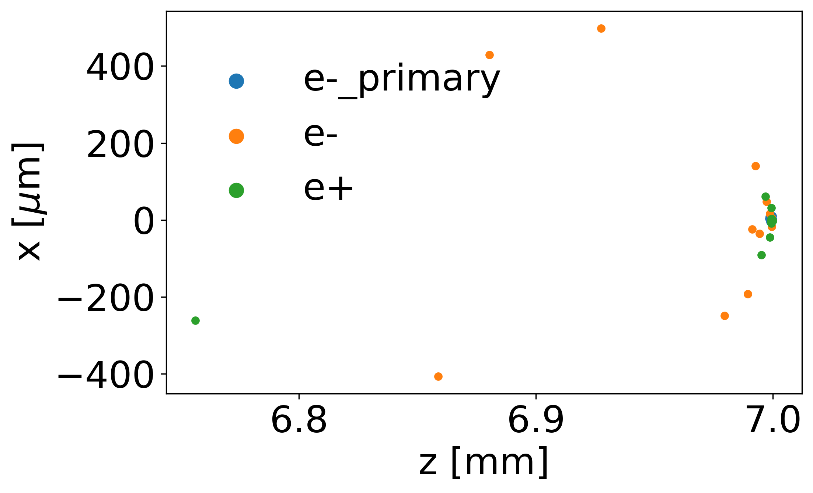
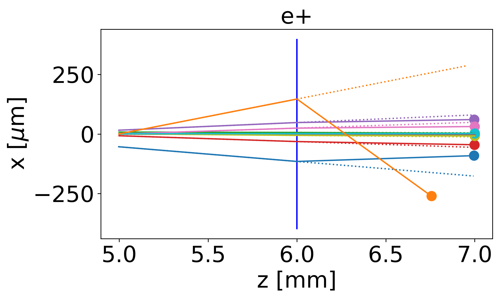

.. _fig:

Results
=======

The *input.txt* text file contained in the `example` folder of the GitHub repo models 20 primary electrons interacting with a 10 mm thick Tungsten foil generating electron-positron pairs through the decay of Bremsstrahlung radiation.

The resulting particles drift for 1 mm in vaccum intersecting a wide thin lens tuned to focus low energy (65 MeV) positrons.

Running GPos with it and then using the Python script *gpos_plot.py* (instructions on how to use it can be found in :ref:`vis`) will generate various plots showing the 2D particle distributions at different stages of the simulation.

At the end of the simulation the lower energy and higher divergence electrons and positrons from the cloud will be spread out as can be seen in Fig. :numref:`fig_2d`.

.. _fig_2d:

   Distribution of the primary beam electrons (blue dots), the electrons and positrons created in the foil (orange and green), after the drift, along the propagation (horizontal axis) and transverse (vertical) directions.
   Propagation direction is from left to right side of the plot.
   Primary electrons are hidden behind the electrons and positrons near z=7 mm.

Figure :numref:`fig_lens` shows the impact of introducing the lens (solid vs dashed lines) in the drift space in the positrons final size (dots) - relevant for example in our case-state where we wish to build a positron source.

.. _fig_lens:

   Trajectory of each positron (various colours) created as they propagate in vacuum from the end of the foil, pass through the thin lens (vertical blue line) at z=6 mm and reach the end of the drift.
   Solid/dashed lines represent results with/out the effect of the lens.
   The dots at the drift position corroborate the lens calculations done in the code and those in the python scripts.
   Axis show the propagation (horizontal) and transverse (vertical) directions.