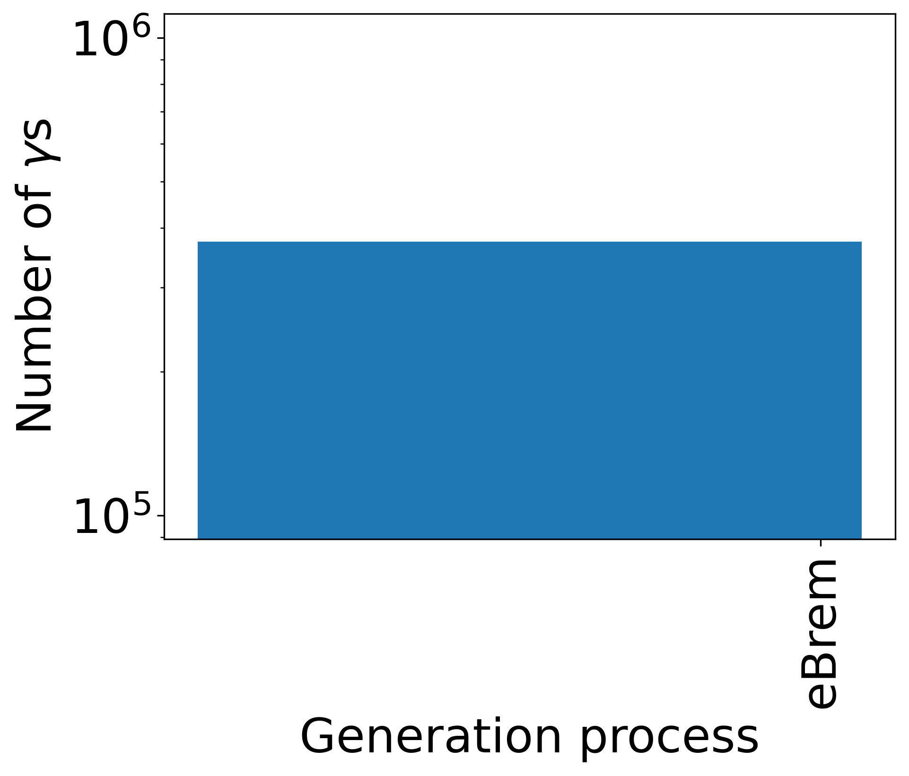
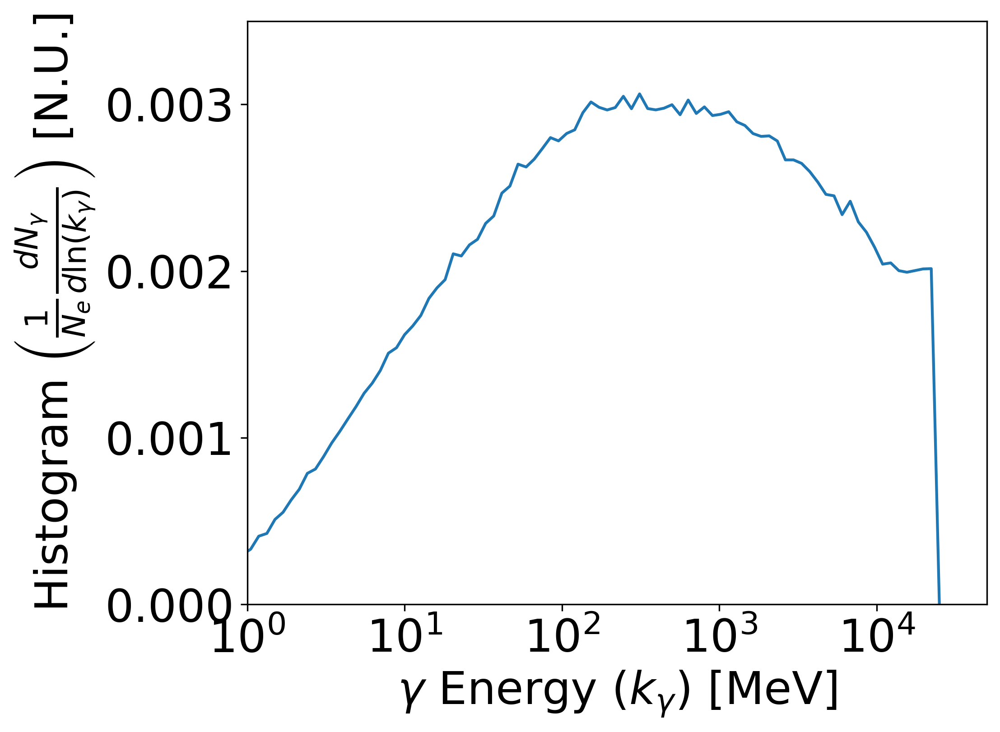

.. _brem:

Bremsstrahlung
==============

When relativistic charged particles, namely electrons, trespass high atomic number (Z) materials they can be deflected by the materials nucleai and loose kinetic energy in the form of Bremsstrahlung radiation.

GPos relies on the `Geant4 <https://geant4.web.cern.ch/node/1>`_ libraries to accurately model various physical interactions, including the production and conversion of Bremsstrahlung radiation into electron-positron pairs [:ref:`Schalicke <Schalicke>`].

.. note::

    For particle energy below 1 GeV, Bremsstrahlung is modelled in Geant4 using a parameterization of the theoretical Seltzer-Berger model and experimental tables.
    
    For higher energy, the radiation is computed using the relativistic differential Bethe-Heitler cross-section representation.
    
    More detailed information on the Geant4 implemented models can be found in the `Physics Reference Manual <https://geant4-userdoc.web.cern.ch/UsersGuides/PhysicsReferenceManual/html/index.html>`_.

In this section, we validate the results obtained with GPos by comparing them qualitatively to those discussed in the recent review of Geant4 [:ref:`Ivanchenko <Ivanchenko>`] and those of GeantV shared in Fig. 6 of [:ref:`Apostolakis <Apostolakis>`].
The simulation setup modelled consists of sending a 25 GeV point-like primary beam of 2M electrons through a 0.15 mm thick Lead foil (`G4_Pb`) placed at the end of a 20x20x0.2 mm :math:`^{3}` world.
The data of all the 373894 generated photons (i.e. :math:`\gamma`) with longitudinal momentum above 0.2 MeV that exit the foil was stored and analysed.

All photons were produced by Bremsstrahlung:

.. _fig_brem:

   Spectra of processes of generation of :math:`\gamma` particles at the end of the GPos simulation.

The associated normalized spectra mimics the curve found in both [:ref:`Ivanchenko <Ivanchenko>`] and [:ref:`Apostolakis <Apostolakis>`]:

.. _fig_brem_hist:

   Histogram of :math:`\gamma` particles energy at the end of the GPos simulation normalized to the number of primary electrons (:math:`N_{e}=2\times10^{6}`).

For fututre reference, the python function used to produce :numref:`fig_brem_hist` is pasted below:

.. code:: python

    def hist_plot(sn, en, proc,nbins = 100):
        plt.figure(figsize=(8, 6))
        f = np.asarray(en)*cte.physical_constants["electron mass energy equivalent in MeV"][0]/(cte.m_e*cte.c**2)
        logbins = np.logspace(np.log10(np.min(f)),np.log10(np.max(f)),nbins)
        hh, bb = np.histogram(f, bins=logbins)
        hh = np.append(hh,0.0)/inputs["np"]
        fig = plt.figure(figsize=(8,6))
        plt.xlabel(r'$\gamma$ Energy (k) [MeV]')
        plt.ylabel(r'Histogram ($dN/d(lnk)N$) [N.U.]')
        plt.plot(bb,hh)
        plt.xscale('log')
        plt.xlim(1,50e3)
        plt.xticks([1,1e1,1e2,1e3,1e4])
        plt.ylim(0,0.0035)
        plt.tight_layout()
        print(bb)
        print(hh)
    for sn in species:
        for proc in ["eBrem"]:
            hist_plot(sn,en[sn][proc],proc)

The datapoints generated are in :download:`data.txt`.

References
----------

.. _Schalicke:

`A. Schalicke et al., *Improved description of Bremsstrahlung for high-energy electrons in Geant4*, 2008 IEEE Nuclear Science Symposium Conference Record, 2008,  pp. 2788-2791, <https://doi.org/10.1109/NSSMIC.2008.4774950>`_ 

.. _Ivanchenko:

`V. N. Ivanchenko et al., *Geant4 Electromagnetic Physics for LHC Upgrade*, 2014 Journal of Physics: Conference Series, i. 2, vol. 513, <https://doi.org/10.1088/1742-6596/513/2/022015>`_

.. _Apostolakis:

`J Apostolakis et al., *HEP Software Foundation Community White Paper Working Group - Detector Simulation*, arXiv:1803.04165 <https://arxiv.org/abs/1803.04165>`_