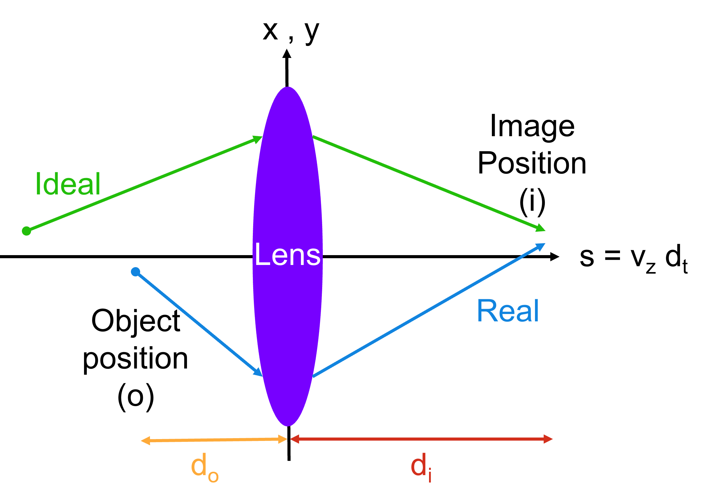

.. _lens:

Drift and Lens
==============

The output of GPos showed that secondary particle beams overlap the primary beam longitudinally, but have lower mean energies.
To spatially separate the beams, it is advantageous to propagate them in vacuum for given drift distances.
That propagation leads to the slower and higher divergence secondaries being lost transversely unless a focusing lens is introduced.

This section includes the main derivation of the drift and thin lens models implemented in :code:`PartBeams::Drift ()`.

.. warning::

    The S.I. system of units is applyed throughout this derivation.
    Conversion to the Geant4 system of units used in GPos is described in :ref:`conv_g4`.

The lens is tuned to deflect an ideal particle trajectory back to its original transverse position, as illustrated in :numref:`fig_ideal_lens` (green arrows).
The optical object (particle initial) longitudinal position is at :math:`z=-d_{o}`, the lens is fixed at :math:`z=0`, and the image (particle final) position is at :math:`z=+d_{i}`.

.. _fig_ideal_lens:

   Schematics of the propagation of ideal (green arrows) and realistic (blue arrows) particles through a thin focusing lens (purple region), along the propagation (horizontal) and transverse axis (vertical).

.. note::

    The particle motion follows the same principles in the two transverse directions :math:`x_{\perp} = x,y`, so the derivations below are generalized to :math:`x_{\perp}`.

The thin lens model corresponds to applying linear, transverse, discrete focusing or defocusing fields (*Dirac* delta functions) that can be represented by :math:`E_{\perp} = \frac{k x_{\perp}}{e}`.
Those fields act on particles through the *Lorentz* force, :math:`F`, which can be integrated about the lens position, :math:`[0-,0+]`, to yield:

.. math::

   \int_{0-}^{0+} \frac{d p_{\perp}}{d z} d_{z} = \int_{0-}^{0+} \frac{d t}{d z}\frac{d p_{\perp}}{d t} d_{z} = \int_{0-}^{0+} \frac{F_{\perp}}{v_{z}} d_{z}  = \frac{q E_{\perp}(0)}{v_{z}}= \frac{q}{e}\frac{k x_{\perp}(0)}{v_{z}},

where the particle charge, momentum, velocity and positions are labeled as :math:`q, p, v` and :math:`x`, :math:`t` is the time variable, and :math:`e` is the electron unit charge.

The transverse motion of each particle can be computed from its momentum as:

.. math::

   \int_{a}^{b} \frac{d x_{\perp}}{d z} d_{z}  = \int_{a}^{b}\frac{d t}{d z}\frac{d x_{\perp}}{d t} d_{z}  = \frac{v_{\perp}}{v_{z}} =  \frac{p_{\perp}}{p_{z}} ~\Rightarrow ~ x_{b} - x_{a} = \Delta z \frac{p_{\perp}}{p_{z}}

The ideal particle momentum is reflected by the lens so that it reaches its initial transverse position after :math:`z = d_{i} = d_{o}`.
Combining the previous equations for that particle allows to determine the general lens strength factor, :math:`k`:

.. math::

   -2 p_{\perp} (0-) = \frac{q}{e} \frac{k x_{\perp}(0)}{v_{z}} \Rightarrow k=  -2 \frac{e}{q} \frac{p_{\perp} v_{z}}{x_{\perp}(0)} = - 2\frac{e}{q}\frac{p_{z}v_{z}\left(x_{\perp}(0)-x_{\perp}(-d_{o})\right)}{d_{o}x_{\perp}(0)}

Making the approximation that the initial transverse displacement is negligible, i.e. :math:`x_{\perp}(o) \ll x_{\perp}(0)`, and including the *Lorentz* relativistic factor :math:`v_{z} = \beta_{z} c \approx \sqrt{1-\frac{1}{\gamma^2}} c`, where :math:`c` is the speed of light in vacuum, the factor :math:`k` can be re-writen as:

.. math::

   k \approx -2\frac{q}{e}\frac{p_{z}v_{z}}{d_{o}} = -2\frac{q}{e}\left(\gamma - \frac{1}{\gamma}\right)\frac{mc^2}{d_{o}},

where :math:`m` is the particle mass.
    
The lens is then uniquely described by the longitudinal momentum of the ideal particle it is tuned to focus, :math:`\gamma`, and its intial distance to the particle, :math:`d_{o}`.

.. warning::

    The lens implemented in GPos aims to focus positrons, so negatively charged particles (such as electrons) are defocused by it because of the :math:`\frac{q}{e}` factor.
    This can be easily changed by removing the minus sign in the factor definition used in :code:`PartBeams::Drift ()`. 

Using the above equations and resorting to the matrix formalism, we can write the particles properties when they reach the lens as:

.. math::

    \begin{gather}
    \begin{bmatrix}
    x_{\perp}(0-) \\
    p_{\perp}(0-)
    \end{bmatrix}
    =
    \begin{bmatrix}
    1 & \frac{d_{o}}{p_{z}}\\
    0 & 1
    \end{bmatrix}
    \begin{bmatrix}
    x_{\perp}(o) \\
    p_{\perp}(o)
    \end{bmatrix}
    \end{gather}

In the lens, the particle position is kept constant and the momentum is transformed according to:

.. math::

    \begin{gather}
    \begin{bmatrix}
    x_{\perp}(0+) \\
    p_{\perp}(0+)
    \end{bmatrix}
    =
    \begin{bmatrix}
    1 & 0\\
    \frac{k_{\perp}}{v_{z}} & 1
    \end{bmatrix}
    \begin{bmatrix}
    x_{\perp}(0-) \\
    p_{\perp}(0-)
    \end{bmatrix}
    =
    \begin{bmatrix}
    1 & 0\\
    \frac{k}{v_{z}} & 1
    \end{bmatrix}
    \begin{bmatrix}
    1 & \frac{d_{o}}{p_{z}}\\
    0 & 1
    \end{bmatrix}
    \begin{bmatrix}
    x_{\perp}(o) \\
    p_{\perp}(o)
    \end{bmatrix}
    \\
    =
    \begin{bmatrix}
    1 & \frac{d_{o}}{p_{z}}\\
    \frac{k}{v_{z}} & \frac{d_{o}k}{v_{z}p_{z}}+1
    \end{bmatrix}
    \begin{bmatrix}
    x_{\perp}(o) \\
    p_{\perp}(o)
    \end{bmatrix}
    \end{gather}

Due to the lack of longitudinal forces, the longitudinal momentum is a constant of motion, :math:`p_{z}(0+)=p_{z}(o)`.
For an ideal particle there is no energy loss or gain because the transverse momentum were simply mirrored.
For the other particles, the energy is updated to account for the new transverse momentum variation, :math:`\gamma (0+) = \sqrt{1.0+\left(p_{x}^2+p_{y}^2+p_{z}^2\right)/m^{2}c^{2}}` and the associated velocities become :math:`v (0+) =p(0+) /\gamma m`.

In GPos, particles were propagated ballistically from the lens until the fastest particle reached the user-defined drift distance, i.e. for :math:`t_{drift} - t_{lens} = d_{drift}/v_{z}(0+) - d_{o}/v_{z}(o)`.
If, instead of capturing the particle data at that instant, we had collected all of them, for example in a detector, at a fixed distance of :math:`z=d_{i}`, their position and momentum would be described by:

.. math::

    \begin{gather}
    \begin{bmatrix}
    x_{\perp}(d_{i}) \\
    p_{\perp}(d_{i})
    \end{bmatrix}
    =
    \begin{bmatrix}
    1 & \frac{d_{i}}{p_{z}}\\
    0 & 1
    \end{bmatrix}
    \begin{bmatrix}
    x_{\perp}(0+) \\
    p_{\perp}(0+)
    \end{bmatrix}
    =
    \begin{bmatrix}
    1 & \frac{d_{i}}{p_{z}}\\
    0 & 1
    \end{bmatrix}
    \begin{bmatrix}
    1 & \frac{d_{o}}{p_{z}}\\
    \frac{k}{v_{z}} & \frac{d_{o}k}{v_{z}p_{z}}+1
    \end{bmatrix}
    \begin{bmatrix}
    x_{\perp}(o)) \\
    p_{\perp}(o)
    \end{bmatrix}
    \\
    = \begin{bmatrix}
    1 + \frac{d_{i}}{p_{z}}\frac{k}{v_{z}} & \frac{d_{o}}{p_{z}} + \frac{d_{i}}{p_{z}}\left(\frac{d_{o}k}{v_{z}p_{z}}+1\right)\\
    \frac{k}{v_{z}} & \frac{d_{o}k}{v_{z}p_{z}}+1
    \end{bmatrix}
    \begin{bmatrix}
    x_{\perp}(o)) \\
    p_{\perp}(o)
    \end{bmatrix}
    \end{gather}

The focal distance, :math:`f`, of the lens varies according to :math:`\gamma` and we can find it by verifying the imaging condition of the matrix above:

.. math::

    \frac{d_{o}}{p_{z}} + \frac{d_{i}}{p_{z}}\left(\frac{d_{o}k}{v_{z}p_{z}}+1\right) = 0 ~\Rightarrow~ d_{i}\frac{d_{o}k}{v_{z}p_{z}} = - d_{o} - d_{i} \\
    \Rightarrow~ \frac{k}{v_{z}p_{z}} = - \frac{d_{o}+d_{i}}{d_{o}d_{i}} = - \frac{1}{d_{o}} - \frac{1}{d_{i}}= -\frac{1}{f},

which can be reduced to :math:`f = - \frac{v_{z}p_{z}}{k} = \frac{d_{o}}{2}`, in the case of the ideal particle.

.. _conv_g4:

S.I. to Geant4
--------------

Below is the list of correspondence between the units used in GPos (that keeps Geant4's conventions) and S.I.:

.. math::
    \begin{align}
    z' &= 10^{3} z (mm) \hspace{10em} t' = 10^{-9} t (ns)\\
    v' &= 10^{-6} v (mm/ns) \hspace{7.5em} p' = \frac{0.511}{m_e c} p (MeV)\\
    k' &= \frac{0.511\times10^{3}}{m_e c} k (MeV/mm)
    \end{align}

Since the momentum is expressed in energy units in GPos, a factor of :math:`c\times10^{-6}` is required in the matrix entries below:

.. math::

   M21 = \frac{k' c\times10^{-6}}{v_{z}'} \hspace{10em} M22 = \frac{d_{o}'k' c\times10^{-6}}{v_{z}'p_{z}'}+1

Testing
-------

:numref:`fig_lens` shows the impact of the thin lens on the trajectory of positrons in the example case studied in Sec. :ref:`fig`.

The validation of the drift and lens calculations implemented in the source code is done against results from the Python scripts contianed in the `example` folder.

Please make sure to verify and replicate changes done to the source code with those python scripts.

.. warning::

    The drift and lens validation is done authomatically by the GitHub **linux** workflow for every **Push** and **PR** to the GPos repo.

